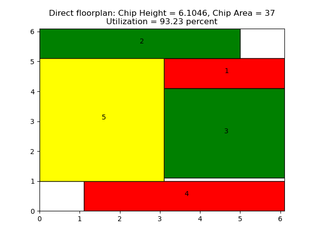

# Optimization of VLSI chip area using Mixed Integer Linear Programming (MILP)

## Environment

NOTE: This repository uses the [cvxpy](https://www.cvxpy.org/) library in Python to solve the problem. Click [here](https://github.com/ShuvoNewaz/MILP-VLSI-Floorplanning-CPP) to view the repository in C++.

To use this repository, please follow these steps:

- Clone this repository or download as a zip.
- Make sure your system has [Anaconda](https://www.anaconda.com/download) installed. Open a terminal to the root directory and enter the following command: `conda env create -f environment.yml`. This will create a conda environment with the required libraries.
- This project makes use of an LP-solver named MOSEK. The tool can be downloaded and the license can be obtained from [MOSEK's website](https://www.mosek.com/resources/getting-started/). Once registered, follow the instructions regarding the directory setup for MOSEK in the email. In particular, pay attention to the directory where the license file is kept.
- The environment is now ready. Activate the environment by typing
    `conda activate MILP_Floorplan`
- A trial run can be performed as follows:

    `python main.py --num_blocks 30 -u True -sa True --runtime 15 -vis True -lp True -size 7`

The command above takes the file with 30 modules and runs a successive augmentation technique for faster optimization. Each superblock contains 7 modules (if remaining number of modules is greater than 7). The superblocks are given 15 seconds to optimize, and the superblock is visulized after optimized. The final floorplan created using the superblocks is also visualized and the dimensions are stored. It also generates a *.lp formatted file which can be used with the [LPSolve tool](https://sourceforge.net/projects/lpsolve/) to optimize. Note: the LPSolve tool takes forever to optimze a 30-module system. Try with a 5 or 10-module system first.

## Overview

### Objective

The objective is to optimize the area of a chip, given,

- The dimension of every module.

- The state of module.

         Hard - width and height are fixed.

         Soft - width and height are flexible, given some aspect ratio.

The hard modules can be rotated for area optimization. There can be no over lap between modules.

### Input

The input is a `*.ilp` file that contains

- The state of the module.

- The dimensions of the module.

- The allowed aspect ratio of the soft modules.

### Task

The task is to parse the `*.ilp` file and read the module parameters. The parameters are then used to formulate and solve an MILP problem. Assuming the final floorplan is square-shaped, the MILP problem solves to minimize the final width, $W$, of the chip.

An auxiliary task is to export to a `*.lp` file that containing all the contraints of the problem. The `*.lp` file can be parsed and solved by an off-the-shelf tool such as [LPSolve](https://sourceforge.net/projects/lpsolve/).

## Problem Formulation

**Acknowledgement**: The models are created on the basis of the work by [Sutanthavibul et al](https://dl.acm.org/doi/abs/10.1145/123186.123255). For a detailed walkthrough of how the prolem is formulated, please refer to their original paper.

### Setup

Let $x$ be the $x$-coordinate, $y$ be the $y$-coordinate, $w$ be the width, $h$ be the height of a module, $m$ be the gradient of a soft module and $c$ be the intercept of a soft module (computed from the aspect ratio). Additionally, let $W$ be the width of the final chip, $H$ be the height of the final chip, and $z$ be a binary variable that determines if a module has been rotated. Let $M = \max(W,H)$ The constraint equations are as follows.

### Hard-hard Non-overlap Constraints

$$x_i + z_i h_i + (1 - z_i) w_i \le x_j + M (x_{ij} + y_{ij})$$
$$x_i - z_i h_j - (1 - z_j) w_j \ge x_j - M (1 - x_{ij} + y_{ij})$$
$$y_i + z_i w_i + (1 - z_i) h_i \le y_j + M (1 + x_{ij} - y_{ij})$$
$$y_i - z_i w_j - (1 - z_j) h_j \ge y_j - M (2 - x_{ij} - y_{ij})$$

### Hard-soft Non-overlap Constraints

These constraints keep the hard module $i$ from overlapping with soft module $j$.

$$x_i + z_i h_i + (1 - z_i) w_i \le x_j + M (x_{ij} + y_{ij})$$
$$x_i - w_j \ge x_j - M (1 - x_{ij} + y_{ij})$$
$$y_i + z_i w_i + (1 - z_i) h_i \le y_j + M(1 + x_{ij} + y_{ij})$$
$$y_i - m_j w_j + c_j \ge y_j - M (2 - x_{ij} - y_{ij})$$

### Soft-soft Non-overlap Constraints

These constraints keep the soft modules from overlapping with each other.

$$x_i + w_i \le x_j + M (x_{ij} + y_{ij})$$
$$x_i - w_j \ge x_j - M (1 - x_{ij} + y_{ij})$$
$$y_i + m_i w_i + c_i \le y_j + M (1 - x_{ij} - y_{ij})$$
$$y_i - m_j w_j + c_j \ge y_j - M (2 - x_{ij} - y_{ij})$$

### Integer Constraints

$z$ determines hard module rotation and $x_{ij}, y_{ij}$ determines if modules $i$ and $j$ are physically connected.

$$z_i=[0,1]$$
$$x_{ij}=[0,1]$$
$$y_{ij}=[0,1]$$

### Aspect Ratio Constraints

$$w_{\mathrm{min}} \le w_i$$
$$w_{\mathrm{max}} \ge w_i$$

### Boundary Constraints

$$x_i, y_i \ge 0$$
$$x_i, y_i \le W$$

#### Hard Modules

$$x_i + z_i h_i + (1 - z_i) w_i \le M$$
$$y_i + z_i w_i + (1 - z_i) h_i \le M$$

#### Soft Modules

$$x_i + w_i \le M$$
$$y_i + m_i w_i + c_i \le M$$

## Results

The optimized floorplan of a 5-module system is shown below. This particular solution is optimal, however, most larger problems will have a sub-optimal solution because of early termination. Green: hard module, red: rotated hard module, yellow: soft module.

  

